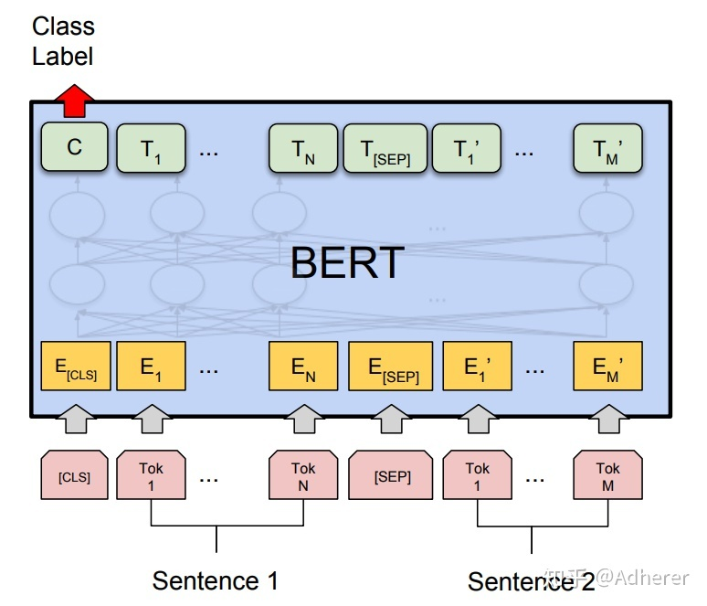

# BERT

https://zhuanlan.zhihu.com/p/95594311

## 1，简单介绍下BERT

BERT中整体是一个自编码语言模型(AutoEncoder LM),并且其设计了两个任务来训练该模型，第一个任务是采用**MaskLM**的方式来训练语言模型，通俗来说就是在输入一句话的时候，随机地选一些要预测的词，然后用一个特殊的符号[MASK]来代替它们，之后让模型根据所给的标签去学习这些地方该填的词。第二个任务在双向语言模型的基础上额外增加了一个句子级别的连续性预测任务，即预测输入BERT的两端文本是否为连续的文本，引入这个任务可以更好的让模型学到连续的文本片段之间的关系，最后的实验表明BERT模型的有效性，并在11项NLP任务中夺得SOTA结果。

BERT相较于原来的RNN,LSTM 可以做到并发执行，同时提取词在句子中的关系特征，并且能在多个不同层次提取关系特征，进而更全面反应句子语义，相较于Word2vec，其又能根据句子上下文获取语义，从而避免歧义出现。同时缺点就是模型参数太多，模型太大，少量数据训练时，容易过拟合。

**1.使用了Transformer作为算法的主要框架**(但只使用了Transformer的Encoder模块)，Transformer能更彻底的捕捉语句中的双向关系。**(与Transformer本身的Encoder端相比，BERT的Transformer Encoder端输入的向量表示，多了Segment Embeddings)**

**2.使用了Mask Language Model(MLM)和Next Sentence Prediction(NSP)的多任务训练目标**

- **MLM :**指在训练的时候随机从输入预料上mask掉一些词，然后通过上下文预测该单词，类似于完形填空。在BERT的实验中，15%的WordPiece Token会被随机Mask掉。在训练模型时，一个句子会被多次喂到模型中用于参数学习，但是Google并没有在每次都mask掉这些单词，而是在确定要Mask掉的单词之后，80%的时候会直接替换为[Mask]，10%的时候将其替换为其它任意单词，10%的时候会保留原始Token。
- **NSP：**NSP 的任务是判断句子B是否是句子A的下文，如果是的话输出IsNext,否则输出NotNext，训练数据的生成方式是从平行语料中随机抽取的连续两句话，其中50%保留抽取的两句话，它们符合IsNext关系，另外50%的第二句话是随机从语料中提取的，它们的关系是NotNext的。

**3.使用更强大的机器训练更大规模的数据，**

BERT 本质上是通过在海量的语料基础上运行**自监督学习方法**为单词学习一个好的**特征表示**，所谓自监督学习是指在没有**人工标注**的数据上运行的**监督学习**。BERT的网络架构使用的是多层Transformer结构，其最大的特点是抛弃了传统的RNN和CNN，通过Attention机制将任意位置的两个单词距离转化成１，有效解决了NLP中长依赖问题。Transformer是一个encoder-decoder的结构，由若干个编码器和解码器堆叠而成，编码器由Multi-Head Attention和一个全连接组成，用于将输入语料转化为特征向量。解码器的输入为编码器的输出以及已经预测的结果，由Masked Multi-Head Attention，Multi-Head Attention以及一个全连接组成，用于输出最后结果的条件概率。

BERT提供了简单和复杂两个模型

- BERT base : L=12(uncased层),H = 768(隐单元),A = 12(Attention head) 。参数总量为110M
- BERT Large: L=24,H = 1024,A = 16 参数总量为340M

L表示网络的层数(即Transformer blocks 的数量)，filter的尺寸是4，H表示的是隐藏神经元，A表示Multi-Head Attention中的self-Attention的数量。

Bert对比GPT和ELMo的优点是只有BERT表征会**基于所有层中的左右两侧语境**

**输入表示**

BERT的输入的编码向量(长度是512)是3个嵌入特征的单位和，这三个词嵌入特征为“

- **WordPiece嵌入**：WordPiece是指将单词划分成一组有限的公共字词单元，能在单词的有效性和字符的灵活性之间取的一个折中的平衡。
- **位置嵌入(Position Embeding)**：位置嵌入是指将单词的位置信息编码成特征向量。是向模型中引入单词位置关系的至关重要的一环。
- **分割嵌入(Segment Embeding)**：用于区分两个句子，(对话，问答场景)，B是否是A的上下文，对于句子对，第一个句子的特征值为0，第二个句子的特征指为1.

[CLS]表示该特征用于分类模型，对分类模型，该符号可以省去，

[SEP]表示分句符号，用于断开输入语料中的两个句子。

## 2，为什么BERT比ElMo效果好，ELMo和Bert的区别是什么

#### 为什么BERT比ELMo效果好？

从网络结构以及最后的实验效果来看，BERT比ELMo效果好主要集中在以下几点原因：

(1).LSTM抽取特征的能力远弱于Transformer

(2).拼接方式双向融合的特征融合能力偏弱(没有具体实验验证，只是推测)

(3).其实还有一点，BERT的训练数据以及模型参数均多余ELMo，这也是比较重要的一点

#### **ELMo和BERT的区别是什么？**

ELMo模型是通过语言模型任务得到句子中单词的embedding表示，以此作为补充的新特征给下游任务使用。因为ELMO给下游提供的是每个单词的特征形式，所以这一类预训练的方法被称为“**Feature-based Pre-Training**”。而BERT模型是“基于Fine-tuning的模式”，这种做法和图像领域基于Fine-tuning的方式基本一致，下游任务需要将模型改造成BERT模型，才可利用BERT模型预训练好的参数。

## 3，BERT有什么局限性？*

从XLNet论文中，提到了BERT的两个缺点，分别如下：

- BERT在第一个预训练阶段，假设句子中多个单词被Mask掉，这些被Mask掉的单词之间没有任何关系，是条件独立的，然而有时候这些单词之间是有关系的，比如”New York is a city”，假设我们Mask住”New”和”York”两个词，那么给定”is a city”的条件下”New”和”York”并不独立，因为”New York”是一个实体，看到”New”则后面出现”York”的概率要比看到”Old”后面出现”York”概率要大得多。
- 但是需要注意的是，这个问题并不是什么大问题，甚至可以说对最后的结果并没有多大的影响，因为本身BERT预训练的语料就是海量的(动辄几十个G)，所以如果训练数据足够大，其实不靠当前这个例子，靠其它例子，也能弥补被Mask单词直接的相互关系问题，因为总有其它例子能够学会这些单词的相互依赖关系。

- BERT的在预训练时会出现特殊的[MASK]，但是它在下游的fine-tune中不会出现，这就出现了预训练阶段和fine-tune阶段不一致的问题。其实这个问题对最后结果产生多大的影响也是不够明确的，因为后续有许多BERT相关的预训练模型仍然保持了[MASK]标记，也取得了很大的结果，而且很多数据集上的结果也比BERT要好。但是确确实实引入[MASK]标记，也是为了构造自编码语言模型而采用的一种折中方式。

另外还有一个缺点，是BERT在分词后做[MASK]会产生的一个问题，为了解决OOV的问题，我们通常会把一个词切分成更细粒度的WordPiece。BERT在Pretraining的时候是随机Mask这些WordPiece的，这就可能出现只Mask一个词的一部分的情况，例如：

------

**[Original Sentence]**

使用语言模型来预测下一个词的probability

**[Original Sentence with CWS]**

使用 语言 **模型** 来 **预测** 下 一个 词 的 **probability**

------

**[Original BERT Input]**

使 用 语 言 **[MASK]** 型 来 **[MASK]** **测** 下 一 个 词 的 **pro [MASK] ##lity**

**[Whold Word Masking Input]**

使 用 语 言 **[MASK]** **[MASK]** 来 **[MASK] [MASK]** 下 一 个 词 的 **[MASK] [MASK] [MASK]**

------

probability这个词被切分成”pro”、”#babi”和”#lity”3个WordPiece。有可能出现的一种随机Mask是把”#babi” Mask住，但是”pro”和”#lity”没有被Mask。这样的预测任务就变得容易了，因为在”pro”和”#lity”之间基本上只能是”#babi”了。这样它只需要记住一些词(WordPiece的序列)就可以完成这个任务，而不是根据上下文的语义关系来预测出来的。类似的中文的词”模型”也可能被Mask部分(其实用”琵琶”的例子可能更好，因为这两个字只能一起出现而不能单独出现)，这也会让预测变得容易。

为了解决这个问题，很自然的想法就是词作为一个整体要么都Mask要么都不Mask，这就是所谓的Whole Word Masking。这是一个很简单的想法，对于BERT的代码修改也非常少，只是修改一些Mask的那段代码。

## 4，BERT的输入输出分别是什么？

BERT模型的主要输入是文本中各个字/词(token)的原始向量，该向量既可以随机初始化，也可以利用Word2Vec等算法进行预训练以作为初始值；输出是文本中各个字/词融合了全文语义信息后的向量表示。

**BERT模型通过查询字向量表将文本中的每个字转换为一维向量，作为模型输入；模型输出则是输入各字对应的融合全文信息后的向量表示。**此外，模型输入除了**字向量(Token Embedding)**,还包括有**文本向量和位置向量**。

- **文本向量**(Segment Embedding)：该向量的取值在模型训练过程中自动学习，用于刻画文本的全局语义信息，并与单字/词的语义信息相融合
- **位置向量**(Position Embedding)：由于出现文本不同位置的字/词所携带的语义信息存在差异，因此，BERT模型对不同位置的字/词分别附加一个不同的向量以作区分

BERT模型将字向量，文本向量和位置向量的**加和**作为模型的输入。特别地，在目前的BERT模型中，文章作者还将英文词汇作进一步切割，划分为更细粒度的语义单位（WordPiece），例如：将playing分割为play和##ing；此外，对于中文，目前作者未对输入文本进行分词，而是直接将单字作为构成文本的基本单位。

需要注意的是，上图中只是简单介绍了单个句子输入BERT模型中的表示，实际上，在做Next Sentence Prediction任务时，在第一个句子的首部会加上一个[CLS] token，在两个句子中间以及最后一个句子的尾部会加上一个[SEP] token。

## 5，针对句子相似度/多标签分类/机器翻译/文本生成的任务，BERT怎么去做fine-tuning?

### 5.1针对句子相似度的任务

实际操作时，上述最后一句话之后还会加一个[SEP] token，语义相似度任务将两个句子按照上述方式输入即可，之后与论文中的分类任务一样，将[CLS] token位置对应的输出，接上softmax做分类即可(实际上GLUE任务中就有很多语义相似度的数据集)。

### 5.2，针对多标签分类的任务

多标签分类任务，即MultiLabel，指的是一个样本可能同时属于多个类，即有多个标签。以商品为例，一件L尺寸的棉服，则该样本就有至少两个标签——型号：L，类型：冬装。

对于多标签分类任务，显而易见的朴素做法就是不管样本属于几个类，就给它训练几个分类模型即可，然后再一一判断在该类别中，其属于那个子类别，但是这样做未免太暴力了，而多标签分类任务，其实是可以**只用一个模型**来解决的。

利用BERT模型解决多标签分类问题时，其输入与普通单标签分类问题一致，得到其embedding表示之后(也就是BERT输出层的embedding)，有几个label就连接到几个全连接层(也可以称为projection layer)，然后再分别接上softmax分类层，这样的话会得到 loss1,loss2,...loss3，最后再将所有的loss相加起来即可。这种做法就相当于将n个分类模型的特征提取层参数共享，得到一个共享的表示(其维度可以视任务而定，由于是多标签分类任务，因此其维度可以适当增大一些)，最后再做多标签分类任务。

### 5.3，针对翻译的任务

针对翻译的任务，因为BERT本身会产生embedding这样的“副产品”，因此可以直接利用BERT输出层得到的embedding，然后在做机器翻译任务时，将其作为输入/输出的embedding表示，这样做的话，可能会遇到UNK的问题，为了解决UNK的问题，可以将得到的词向量embedding拼接字向量的embedding得到输入/输出的表示(对应到英文就是token embedding拼接经过charcnn的embedding的表示)。

## 6，BERT应用于有空格缺失或者单词拼写错误等数据是否有效?有什么改进方法？

对于有空格缺失的数据可以是u用Bi-LSTM+CRF做分词处理，待其处理成正常文本后再将其输入BERT做下游任务。如果有少量的单词拼写错误，那么造成的影响应该不会太大，因为BERT预训练的语料非常丰富，而且很多语料也不够干净，其中肯定也还是会含有不少单词拼写错误这样的情况。但是如果单词拼写错误的比例比较大，比如达到了30%、50%这种比例，那么需要通过人工特征工程的方式，以中文中的同义词替换为例，将不同的错字/别字都替换成同样的词语，这样减少错别字带来的影响。例如花被、花珼、花呗、花呗、花钡均替换成花呗。

## 7，BERT的embedding向量从何而来

以中文为例，**BERT模型通过查询字向量表将文本中的每个字转换为一维向量，作为模型输入(还有position embedding和segment embedding)；模型输出则是输入各字对应的融合全文语义信息后的向量表示。**

而对于输入的token embedding、segment embedding、position embedding都是随机生成的，需要注意的是在Transformer论文中的position embedding由sin/cos函数生成的固定的值，而在这里代码实现中是跟普通word embedding一样随机生成的，可以训练的。作者这里这样选择的原因可能是BERT训练的数据比Transformer那篇大很多，完全可以让模型自己去学习。

### **8.BERT模型为什么要用mask？它是如何做mask的？其mask相对于CBOW有什么异同点？**

### **8.1 BERT模型为什么要用mask?**

BERT通过在输入X中随机Mask掉一部分单词，然后预训练过程的主要任务之一是根据上下文单词来预测这些被Mask掉的单词。其实这个就是典型的Denosing Autoencoder的思路，那些被Mask掉的单词就是**在输入侧加入的所谓噪音。**类似BERT这种预训练模式，被称为DAE LM。因此总结来说BERT模型 [Mask] 标记就是引入噪音的手段。

关于DAE LM预训练模式，优点是它能比较自然地融入双向语言模型，同时看到被预测单词的上文和下文，然而缺点也很明显，主要在输入侧引入[Mask]标记，导致预训练阶段和Fine-tuning阶段不一致的问题。

### **8.2 它是如何做mask的？**

给定一个句子，会随机Mask 15%的词，然后让BERT来预测这些Mask的词，如同上述10.1所述，在输入侧引入[Mask]标记，会导致预训练阶段和Fine-tuning阶段不一致的问题，因此在论文中为了缓解这一问题，采取了如下措施：

如果某个Token在被选中的15%个Token里，则按照下面的方式随机的执行：

- 80%的概率替换成[MASK]，比如my dog is hairy → my dog is [MASK]
- 10%的概率替换成随机的一个词，比如my dog is hairy → my dog is apple
- 10%的概率替换成它本身，比如my dog is hairy → my dog is hairy

这样做的好处是，BERT并不知道[MASK]替换的是这15%个Token中的哪一个词(**注意：这里意思是输入的时候不知道[MASK]替换的是哪一个词，但是输出还是知道要预测哪个词的**)，而且任何一个词都有可能是被替换掉的，比如它看到的apple可能是被替换的词。这样强迫模型在编码当前时刻的时候不能太依赖于当前的词，而要考虑它的上下文，甚至对其上下文进行”纠错”。比如上面的例子模型在编码apple是根据上下文my dog is应该把apple(部分)编码成hairy的语义而不是apple的语义。

### **8.3 其mask相对于CBOW有什么异同点？**

**相同点：**CBOW的核心思想是：给定上下文，根据它的上文 Context-Before 和下文 Context-after 去预测input word。而BERT本质上也是这么做的，但是BERT的做法是给定一个句子，会随机Mask 15%的词，然后让BERT来预测这些Mask的词。

**不同点：**首先，在CBOW中，每个单词都会成为input word，而BERT不是这么做的，原因是这样做的话，训练数据就太大了，而且训练时间也会非常长。

其次，对于输入数据部分，CBOW中的输入数据只有待预测单词的上下文，而BERT的输入是带有[MASK] token的“完整”句子，也就是说BERT在输入端将待预测的input word用[MASK] token代替了。

另外，通过CBOW模型训练后，每个单词的word embedding是唯一的，因此并不能很好的处理一词多义的问题，而BERT模型得到的word embedding(token embedding)融合了上下文的信息，就算是同一个单词，在不同的上下文环境下，得到的word embedding是不一样的。

## **9，为什么BERT中输入数据的[mask]标记为什么不能直接留空或者直接输入原始数据，在self-attention的Q K V计算中，不与待预测的单词做Q K V交互计算？**

这个问题还要补充一点细节，就是数据可以像CBOW那样，每一条数据只留一个“空”，这样的话，之后在预测的时候，就可以将待预测单词之外的所有单词的表示融合起来(均值融合或者最大值融合等方式)，然后再接上softmax做分类。

乍一看，感觉这个idea确实有可能可行，而且也没有看到什么不合理之处，但是需要注意的是，这样做的话，需要每预测一个单词，就要计算一套Q、K、V。就算不每次都计算，那么保存每次得到的Q、K、V也需要耗费大量的空间。总而言之，这种做法确实可能也是可行，但是实际操作难度却很大，从计算量来说，就是预训练BERT模型的好几倍(至少)，而且要保存中间状态也并非易事。其实还有挺重要的一点，如果像CBOW那样做，那么文章的“创新”在哪呢~

## 10，BERT的两个预训练任务对应的损失函数是什么(公式)

BERT 的损失函数由两部分组成，第一部分来自Mask_LM的**单词级别分类任务**，另一部分是**句子级别的分类任务**，通过两个任务的联合学习，可以使得BERT学习到的表征既有token级别信息，同时也包含了句子级别的语义信息，具体损失函数如下:
$$
L(\theta,\theta_1,\theta_2) = L_1(\theta,\theta_1)+L_2(\theta,\theta_2)
$$
其中$\theta$是BERT中Encoder部分的参数，$\theta_1$是Mask-LM任务中在Encoder上所接的输入层的参数，$\theta_2$则是句子预测任务中在Encoder接上的分类器参数。因此，在第一部分的损失函数中，如果被mask的词集合为M，因为它是一个词典大小|V|上的多分类问题，具体来说
$$
L_1(\theta,\theta_1) = -\sum_{i=1}^{M}logp(m = m_i|\theta,\theta_1),m_i\in[1,2,..,|V|]
$$
在句子预测任务中，也是一个分类问题的损失函数：
$$
L_2(\theta,\theta_2) = -\sum_{j=1}^{N}logp(n=n_i|\theta,\theta_2),n_i\in[IsNext,NotNext]
$$
因此，两个任务联合学习的损失函数是：
$$
L(\theta,\theta_1,\theta_2) = -\sum_{i=1}^{M}logp(m = m_i|\theta,\theta_1)-\sum_{j=1}^{N}logp(n=n_i|\theta,\theta_2)
$$
具体的预训练工程实现细节方面，BERT 还利用了一系列策略，使得模型更易于训练，比如对于学习率的 warm-up 策略，使用的激活函数不再是普通的 ReLu，而是 GeLu，也使用了 dropout 等常见的训练技巧。

## 11，词袋模型到word2vec改进了什么？word2vec到BERT又改进了什么？

### 11.1，词袋模型到word2vec改进了什么？

词袋模型(bag of word model)是将一段文本(比如一个句子或是一个文档)用一个"装着这些词的袋子"来表示，这种表示方式不考虑你文法以及词的顺序，**而在用词袋模型时，文档的向量表示直接将各词的次品向量表示加和**，通过上述描述，词袋模型有以下两个缺点

- 词向量化后，词与词之间是有权重大小关系的，不一定词出现的越多，权重越大
- 词和词之间没有顺序关系

而word2vec是考虑**词语位置**关系的一种模型。通过大量语料的训练，将每一个词语映射成一个**低维稠密向量**，通过求余弦的方式，可以判断两个词语之间的关系，word2vec其底层主要采用基于CBOW和Skip-Gram算法的神经网络模型。

因此，综上所述，词袋模型到word2vec的改进主要集中于以下两点：

- 考虑了词与词之间的顺序，引入了上下文的信息
- 得到了词更加准确的表示，其表达的信息更为丰富

### 11.2，word2vec到BERT改进了什么？

word2vec到BERT的改进之处其实并没有很明确的答案，BERT的思想很大程度上来源于CBOW模型，如果从准确率上说改进的话，BERT利用更深的模型，以及海量的预料，得到embedding表示，来做下游任务时的准确率是要比word2vec高很多的，实际上这也离不开模型的加码以及数据的加码。再从方法的意义角度来说，BERT的重要意义在于给大量的NLP任务提供了一个泛化能力很强的预训练模型，而仅仅使用word2vec产生的词向量表示，不仅能够完成的任务比BERT少了很多，而且很多时候直接利用word2vec产生的词向量表示给下游任务提供信息，下游任务的表现不一定会很好，甚至会很差。